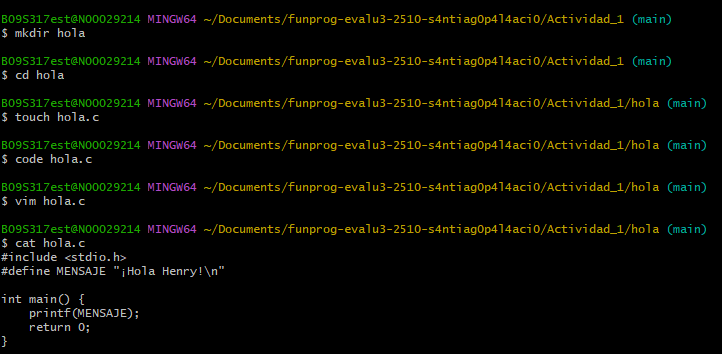
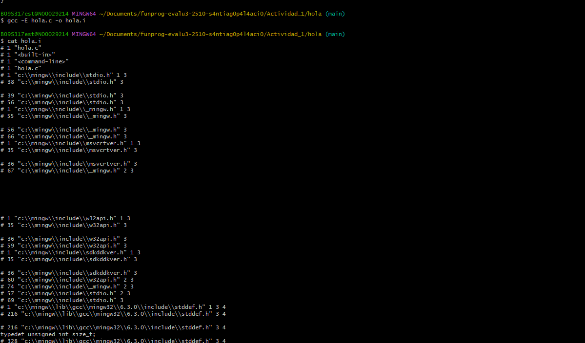
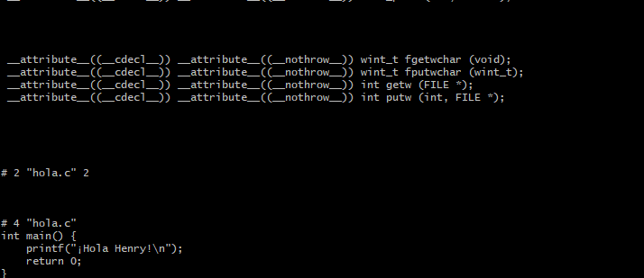
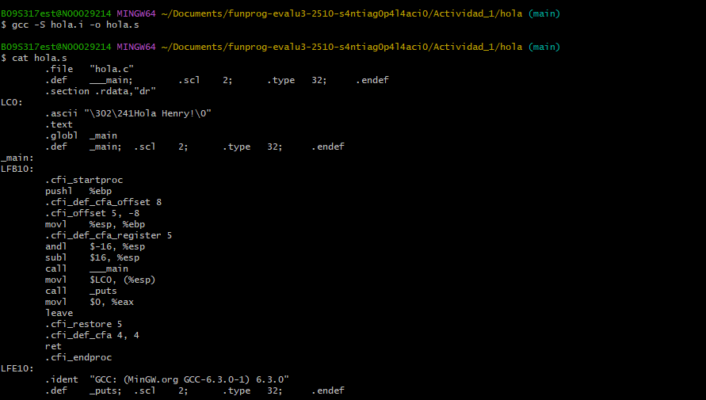
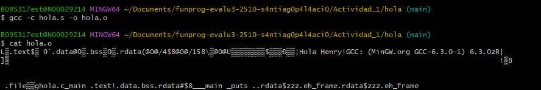
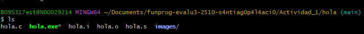
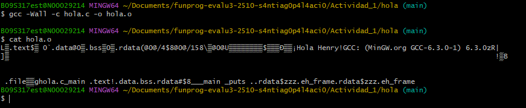
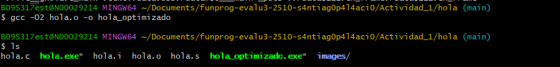

# 🏋️ Ejercicios Prácticos

## 1. Visualizando cada etapa

1. **Crea un archivo** llamado `hola.c` con el siguiente contenido:
    
    ```c
    #include <stdio.h>
    #define MENSAJE "¡Hola Henry!\n"
    
    int main() {
        printf(MENSAJE);
        return 0;
    }
    ```
    
2. **Ejecuta el preprocesador**:
    
    ```bash
    gcc -E hola.c -o hola.i
    ```


    - Abre `hola.i` y observa el código expandido.

 
 
3. **Compila a ensamblador**:
    
    ```bash
    gcc -S hola.i -o hola.s
    
    ```
    
    - Revisa `hola.s` para ver el código ensamblador.

 
4. **Genera el objeto**:
    
    ```bash
    gcc -c hola.s -o hola.o
    
    ```
    
    - Observa que se crea `hola.o`.


5. **Linkea para crear el ejecutable**:
    
    ```bash
    gcc hola.o -o hola
    
    ```
    
    - Ejecuta `./hola` y revisa la salida.


## 2. Explorando flags adicionales

- Usa `Wall` para ver advertencias:
    
    ```bash
    gcc -Wall -c hola.c -o hola.o
    
    ```
    

- Prueba optimizaciones con `O2`:

Este flag aumenta el nivel de optimización para generar un binario más rápido o eficiente. Existen otros niveles y banderas de optimización (como `O3`, `Os`, etc.) que puedes experimentar para encontrar el equilibrio adecuado entre velocidad y tamaño.
    
    ```bash
    gcc -O2 hola.o -o hola_optimizado
    
    ```
    

## 3. Integrando librerías externas

- Crea una segunda librería (por ejemplo, una simple función en un archivo aparte) y compila todo en consola paso por paso (preprocesar, compilar, ensamblar y linkear con la nueva librería).

---

# 🤔 Preguntas de Control de Comprensión

1. ¿Cuál es la función principal del **preprocesador** en C?
    - La función principal del preprocesador en C es reemplazar los valores constantes a lo largo del programa, por el valor especificado por definición o inclusión de cabeceras. También se pueden hacer condicionales basafdos en si algo está definido o no; y la comparación sobre si está definido o no, se hace desde el preprocesamiento.

2. ¿Por qué se dice que el **código objeto** (.o) no es directamente ejecutable?
    - Generalmentenosotros incluimos biblitecas para nuestros archivos de c, por ejemplo en el caso de necesitar raices o herramientas matemáticas más complejas; o bien puede ser que tengamos varios archivos de C. Si solo tuvieramos en cuenta el archivo C original con su contendido, al no importar y combinar bibliotecas o archivos, el código no funcionaría. El archivo objeto no es ejecutable porque no está conectado con sus complementos, bibliotecas o funciones adicionales. Luego, el linker, los enlaza y permite su funcionamiento.

3. ¿Qué diferencia existe entre el **código ensamblador** (.s) y el **código objeto** (.o)?
    - El ensamblador es la primera parte de piner el código en un lenguaje de más bajo nivel, para que posteriormente la máquina lo lea. El código objeto, no es ejecutable, pero está listo para que por medio del linler se tenga un resultado ejecutable. 


4. ¿Para qué sirve la opción `S` en GCC?
    - Sirve para generar el código ensamblador, sin crear el ejecutable en ese paso.
    
5. ¿Qué sucede si omitimos la etapa de **linker**?
    - Si omitimos la etapa del linker, no podemos enlazar los archivos o bibliotecas necesarias para la ejecución del código ni podríamos convertir el tipo objeto a lenguaje de máquina. 
Incluye estas preguntas en tu bitácora y respóndelas después de realizar los ejercicios.

---

# 🎥 Recursos Externos Recomendados

- [Video:](https://www.youtube.com/watch?v=3Vw21hICuCA) [Proceso de Compilación en C](https://youtu.be/IMSetC-A6hg?si=yLMmIx4dP1P_KYws)
- [Artículo:](https://www.geeksforgeeks.org/compilation-process-in-c/) [**Tutorial: Compilar un programa de C en la línea de comandos**](https://learn.microsoft.com/es-es/cpp/build/walkthrough-compile-a-c-program-on-the-command-line?view=msvc-170)
- [Documentación oficial de GCC](https://gcc.gnu.org/onlinedocs/)

Estos enlaces profundizan en cada etapa y pueden ayudarte a solidificar los conceptos.

---

# 💡 Consejos y Opinión Personal

- Siempre revisa los **warnings** del compilador. Te pueden ahorrar muchos dolores de cabeza.
- Conocer el pipeline ayuda a **depurar** mejor y a **optimizar** tu código de forma más eficiente.
- Un buen manejo de **Makefiles** o herramientas de build automatizan todo este proceso, ¡pero saber la teoría nunca está de más!

---

<aside>
💡

Con esto tienes una visión clara del proceso de compilación en C, ejercicios para practicar paso a paso, preguntas para reflexionar y algunos recursos externos para seguir aprendiendo.

</aside>