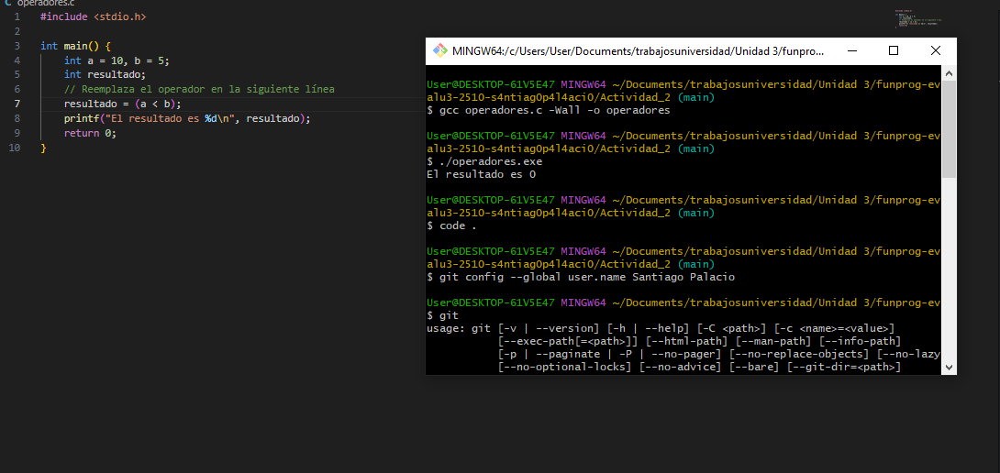
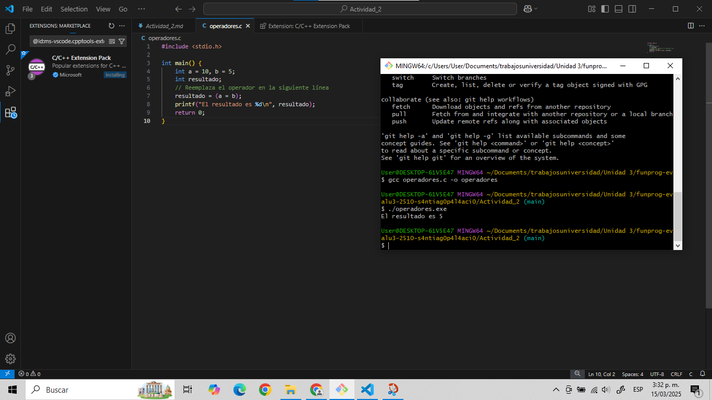
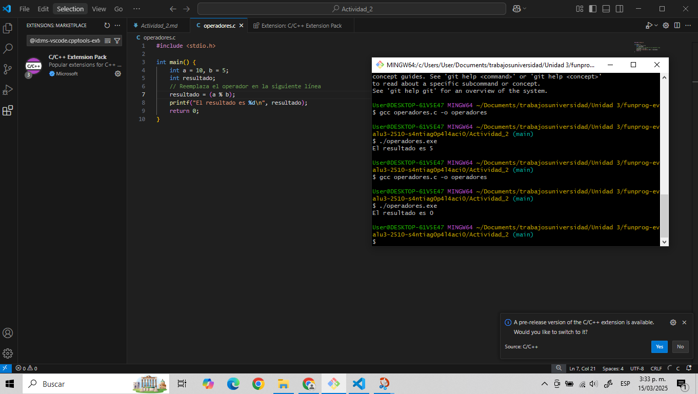
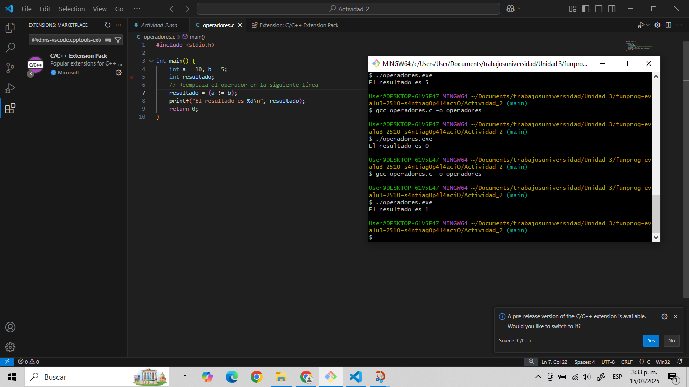

## 4. Actividad: Probando Operadores Relacionales

1. Copia el siguiente **código base** y pégalo en tu editor de C.
2. Reemplaza en el lugar indicado la operación relacional, toma al menos 3 de las que te propongo a continuación. Dale valores a las variables involucradas y **guarda los pantallazos de los resultados en tu bitácora.** 

```c
(A > 0) && (B > C) || (C > 0)
(X < Y) && (Z >= 0) || (Y == 10)
(A * B < C) && !(B == 4) || (C / B >= 2)
(A < B) && (C != 0) || (A + B > C)
(A > B) && (B > C) && (C > 0)
(M % 2 == 0) || (N % 3 != 0) && (P > Q)
!(R <= S) && (T > U) || (V == W)
(D + E >= F) && (G - H < I) || !(J == K)
(L * M > N) || (O / P < Q) && (R != S)
(T % 5 == 0) && !(U < V) || (W + X > Y)
```

Observa el resultado que aparece en pantalla (1 para verdadero, 0 para falso).

```c
#include <stdio.h>

int main() {
    int a = 10, b = 5;
    int resultado;
    // Reemplaza el operador en la siguiente línea
    resultado = (a > b);
    printf("El resultado es %d\n", resultado);
    return 0;
}
```

 - Tarea: Prueba al menos tres combinaciones diferentes y anota los resultados.

    - 
    ---
    - 
    ---
    - 
    ---
    - 
    ---

Piensa 🤔 cómo podrías modificar el programa del **menú** para que, después de ejecutar una opción, te vuelva a preguntar qué quieres hacer.

**Pista**: Usa un bucle (`while`, `do-while` o `for`) que se mantenga activo mientras la opción seleccionada no sea "Salir".

<aside>
💡

Analiza cuidadosamente el problema antes de escribir el código.  No hay una única manera de solucionar el problema.

**Registra tu solución en tu repositorio.**

</aside>

- Si se va a ejecutar dentro de un marco repetitivo controlado, es decir un determinado numero de repeticiones, es mejor usar el for, si por ejemplo, en el caso de los leds por protocolo se tenga que probar tres veces o algo por el estilo. Como la variable cambia durante la ejecución del loop, es mejor usar un do While. Si el primer valor se define fuera del loop, el While, sería la mejor opción. En el mismo menú de opciones se pone un ítem adicional para parar, y cuando el caso sea el de salir, se usa esa condición para salir del loop. 

## 10. Ejercicios Propuestos

1. **Condicional doble**: Escribe un programa que pregunte la edad y te indique si eres mayor o menor de edad.

- [edad](./ejercicios_obligatorios/edad/)

2. **`if-else if-else`**: Crea un programa que evalúe la calificación de un alumno (0-5) e imprima: "Insuficiente", "Aceptable", "Sobresaliente", etc.

- [notas](./ejercicios_obligatorios/notas/)

3. **Menú repetitivo**: Implementa un menú con al menos **cuatro** opciones y un bucle que permita seleccionar repetidamente cualquier opción hasta que se elija "Salir".

- [menu](./ejercicios_obligatorios/menu/)