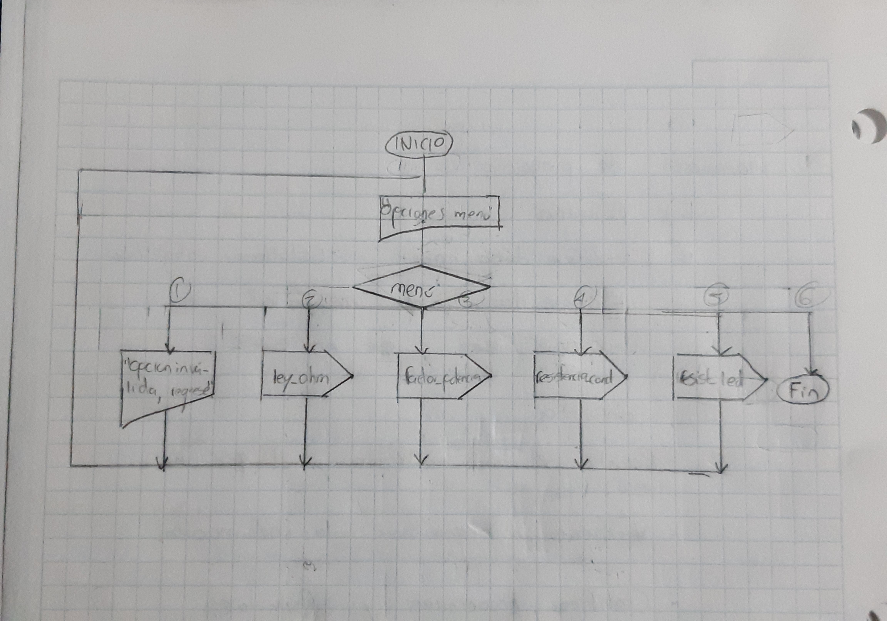
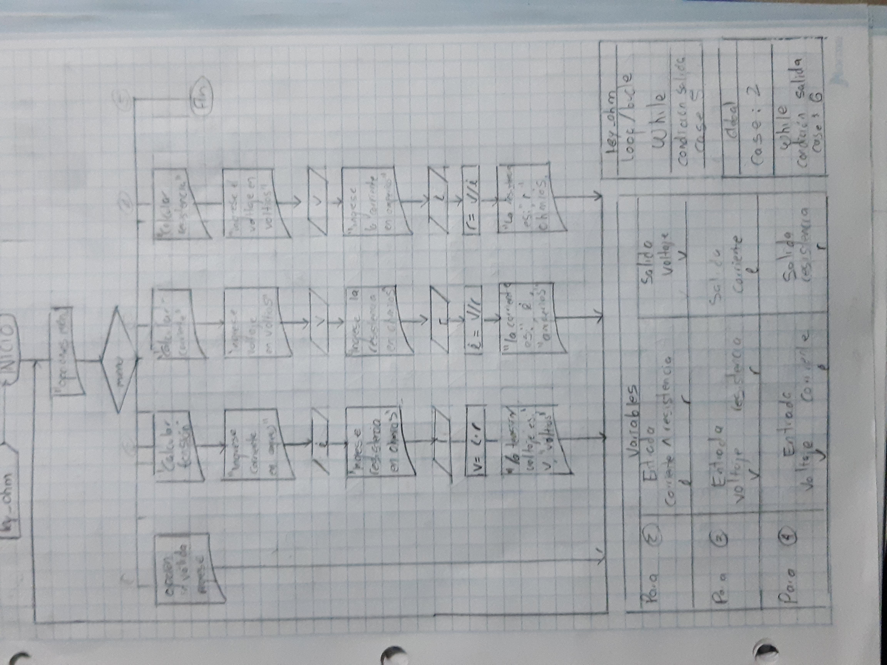

## Referencias

---

## Menú

---

## Ley de Ohm

---

# Factor de Potencia

---

# Resistencia de un Conductor

---

## Valor de la Resistencia para un LED.

# NOTAS

- Los menúes de las funciones, a la hora de hacer el código en C, se separaron y se establecieron como funciones aparte.
